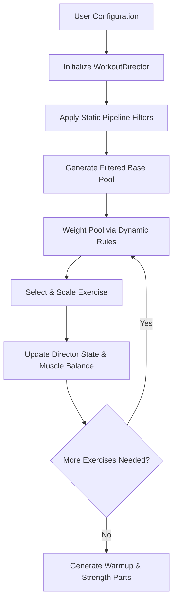

# Workout Generation Engine Design

This document details the design, constraints, and statistical verification of the smart workout generation engine.

---

## 🏛️ 1. Core Architecture: The "Director" Pattern

Rather than utilizing pure random exercise selection (which leads to unbalanced muscle group fatigue and repetitive workouts), the engine implements a state-based **`WorkoutDirector`** (defined in `src/engine/generator.js`).

The generation workflow runs as a structured pipeline:



### Static Pipeline vs. Dynamic Pipeline
*   **Static Pipeline (`STATIC_PIPELINE`)**: Executed once during director initialization. Filters out exercises that do not match the user's available equipment, targeted duration, or that conflict with specified injury avoidance configurations.
*   **Dynamic Pipeline (`DYNAMIC_PIPELINE`)**: Executed prior to picking *each* exercise slot. Evaluates the current state of the generated workout (e.g., currently selected movement patterns, last exercise chosen) and applies weight adjustments to bias the candidates.

---

## ⚙️ 2. Intelligent Balancing & Flow Control

To ensure workouts feel "programmed" rather than purely randomized, the engine enforces several algorithmic constraints:

### A. Dynamic Pattern Balancing (Push/Pull Ratio)
To prevent push dominance (a common problem where pushups/thrusters overload the shoulders while pulling patterns are neglected), the director monitors movement balances.
```javascript
const targetBalance = { Push: 1, Pull: 1, Squat: 1, Hinge: 1, Core: 0.5 };
```
If the generated workout drifts too far from this ratio, the dynamic pipeline heavily weights underrepresented patterns.

### B. Chipper Flow Control (Pairwise Constraints)
For long, single-round workouts ("Chippers"), performing consecutive movements targeting the same primary muscle groups causes premature failure. The engine applies a `Pairwise Constraint` checking adjacent exercises:
*   *Invalid overlap*: Push Press -> Handstand Push-Ups (both fatigue shoulders/overhead).
*   *Valid sequence*: Push Press -> Box Jump (alternates shoulders to lower body).
The dynamic pipeline penalizes candidates whose tags overlap heavily with the last selected exercise.

### C. Smart Substitution (Difficulty Tuning)
Rather than simply scaling rep numbers downward for beginners (e.g., prescribing 1 rep of a muscle-up, which is impossible), the engine uses movement substitutions:
*   **High-Skill Moves** (e.g., Muscle-Ups, Handstand Push-Ups) are tagged with `'skill'`.
*   For **Beginner** or **Scaled** difficulties, the director intercepts these movements and substitutes them with appropriate low-skill progressions (e.g., DB Push Press or Strict Pushups) before scaling repetitions.

### D. Complementary Buy-In Logic
Buy-ins (cardio or core work performed before the main workout starts) are selected to oppose the main workout's focus:
*   If the main workout is **Cardio** focused, the buy-in selects from **Strength** or **Core** pools to balance the stimulus.
*   If the main workout is **Strength** focused, the buy-in selects a **Cardio** movement to raise the heart rate.

---

## 📊 3. Engine Simulation & Statistical Tuning

To verify the mathematical balance, safety, and variety of the generator, we run simulation scripts simulating 10,000 workout generations.

### Key Performance Indicators (KPIs)
*   **Push/Pull Balance**: Targeted to hover near `1.0` to ensure equal shoulder joint stimulus.
*   **Skill Leakage**: Defined as the percentage of high-skill elements (e.g., Handstand Push-ups, Bar Muscle-ups) that erroneously show up in Beginner-configured workouts. This must remain at `0.00%`.
*   **Impossible Exercises**: Exercises requiring equipment the user does not have must never be selected (`0.00%`).
*   **Pool Saturation**: Monitored via hits per exercise to ensure all database items are distributed reasonably, preventing repetitive selections.

### Simulation Commands
Use the package scripts to re-run simulations whenever tweaking scaling, pipelines, or adding database items:
*   **`npm run analyze`**: Runs 10,000 iterations to verify global distributions, pool utilization, and check for constraint failures.
*   **`npm run analyze:logic`**: Performs focused sanity-checks on exercise repetition ranges across different durations.
